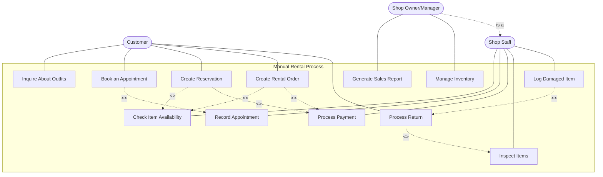

# Manual Rental System - Use Case Diagram

## PlantUML Diagram

The [manual_rental_system.puml](manual_rental_system.puml) file contains the PlantUML source code for the use case diagram. To render this diagram, you'll need to:

1. Install Java Runtime Environment (JRE)
2. Download PlantUML jar file from https://plantuml.com/download
3. Run the command: `java -jar plantuml.jar manual_rental_system.puml`

## Mermaid Diagram Representation

Below is a MermaidJS representation of the same use case diagram that can be viewed in most Markdown editors:

## Use Case Descriptions

### Primary Actors:
- **Customer**: Rents outfits from the shop
- **Shop Staff**: Handles day-to-day rental operations
- **Shop Owner/Manager**: Manages business operations and staff

### Use Cases:

1. **Inquire About Outfits**: Customer asks about available outfits
2. **Book an Appointment**: Customer schedules a fitting appointment
3. **Create Reservation**: Customer reserves specific items for a date
4. **Create Rental Order**: Customer formally rents items
5. **Process Return**: Customer returns rented items
6. **Check Item Availability**: Staff verifies if items are available
7. **Record Appointment**: Staff logs customer appointments
8. **Process Payment**: Staff handles payment transactions
9. **Inspect Items**: Staff examines returned items for damage
10. **Log Damaged Item**: Staff records any damages found
11. **Generate Sales Report**: Manager creates business performance reports
12. **Manage Inventory**: Manager updates item availability and stock

### Relationships:
- **Include**: One use case must include another to complete
- **Extend**: One use case extends another under certain conditions
- **Generalization**: Manager inherits all Staff capabilities